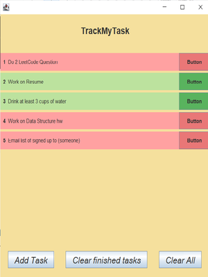

# TrackMyTask-Java
This is a To-Do List written in Java and Java Swing in order to make it interactive with the user. It will be tracking the things that you have to do. There are functions like adding tasks, removing tasks you are done with, and clearing all the tasks you added. 

